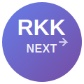

<div align="center">



# rkk-next

**Production-ready SEO, Performance & Routing SDK for Next.js**

[](https://www.npmjs.com/package/rkk-next)
[](https://www.npmjs.com/package/rkk-next)
[](./LICENSE)
[](https://www.typescriptlang.org/)
[](https://github.com/ROHIT8759/rkk-next)
[](https://github.com/ROHIT8759/rkk-next)

**Enterprise-grade toolkit for building SEO-optimized, lightning-fast Next.js applications**

[Get Started](#-quick-start) · [Project Structure](./docs/PROJECT_STRUCTURE.md) · [Backend Docs](./docs/BACKEND.md) · [Examples](./examples/) · [Report Bug](https://github.com/ROHIT8759/rkk-next/issues)

</div>

---

## 🎯 Why rkk-next?

Building performant, SEO-optimized Next.js applications requires juggling multiple concerns: meta tags, structured data, route prefetching, image optimization, and caching strategies. **rkk-next** provides production-tested solutions out of the box.

**Perfect for:**

- 🚀 Startups needing rapid development
- 💼 Enterprise applications requiring SEO excellence
- 🎨 Marketing websites and landing pages
- 🌐 Web3 dashboards and SaaS platforms
- ⚡ Performance-critical applications

## ✨ Key Features

<table>
<tr>
<td width="50%">

### 🔍 **SEO Excellence**

- Comprehensive meta tag management
- OpenGraph & Twitter Cards
- JSON-LD structured data (Schema.org)
- Automatic canonical URLs
- Server-side rendering optimized

</td>
<td width="50%">

### ⚡ **Performance First**

- Intelligent route prefetching
- Network-aware optimizations
- Lazy loading for heavy components
- CDN & edge caching strategies
- Built-in security headers

</td>
</tr>
<tr>
<td width="50%">

### 📊 **Analytics Ready**

- Core Web Vitals tracking
- Route navigation metrics
- Performance monitoring
- Custom event tracking
- Production-ready insights

</td>
<td width="50%">

### ⚡ **Backend Utilities**

- Express-like middleware
- API route optimization
- Rate limiting & CORS
- Response caching
- Request validation

</td>
</tr>
<tr>
<td width="50%">

### 🎨 **Developer Experience**

- Full TypeScript support
- Zero configuration needed
- Pages Router & App Router
- Comprehensive documentation
- Active maintenance

</td>
</tr>
</table>

---

## 🚀 Quick Start

### Create New Project (Recommended)

Get started instantly with our CLI tool:

```bash
npx create-next-rkk@latest my-app
cd my-app
npm run dev
```

### Add to Existing Project

Install into your existing Next.js application:

```bash
npm install rkk-next
# or
yarn add rkk-next
# or
pnpm add rkk-next
```

---

## 📖 Usage Examples

### SEO Meta Management

Centralize your SEO configuration with type-safe components:

```tsx
import { MetaManager } from "rkk-next";

export default function HomePage() {
  return (
    <>
      <MetaManager
        title="Home | My App"
        description="Production-ready Next.js application with enterprise SEO"
        keywords="Next.js, React, SEO, Performance"
        image="https://myapp.com/og-image.png"
        siteName="My App"
        twitterHandle="myhandle"
      />

      <main>{/* Your content */}</main>
    </>
  );
}
```

### Structured Data (JSON-LD)

Improve search engine understanding with structured data:

```tsx
import { JsonLd } from "rkk-next";

export default function ArticlePage() {
  return (
    <>
      <JsonLd
        type="Article"
        data={{
          headline: "Advanced Next.js SEO Techniques",
          image: "https://myapp.com/article.jpg",
          datePublished: "2025-12-18T08:00:00.000Z",
          author: {
            "@type": "Person",
            name: "John Doe",
          },
        }}
      />

      <article>{/* Article content */}</article>
    </>
  );
}
```

### Smart Routing & Prefetching

Enhance navigation performance with intelligent prefetching:

```tsx
import { SmartLink, observeRoutes } from "rkk-next";
import { useEffect } from "react";

export default function Navigation() {
  useEffect(() => {
    // Track route changes for analytics
    const unsubscribe = observeRoutes((event) => {
      analytics.track("page_view", {
        url: event.url,
        duration: event.duration,
      });
    });

    return unsubscribe;
  }, []);

  return (
    <nav>
      <SmartLink href="/products" prefetchOnHover>
        Products
      </SmartLink>
    </nav>
  );
}
```

### Optimized Images

Ensure SEO-compliant and performant images:

```tsx
import { OptimizedImage } from "rkk-next";

export default function Hero() {
  return (
    <OptimizedImage
      src="/hero-banner.jpg"
      alt="Professional hero banner showcasing our product"
      width={1920}
      height={1080}
      priority // For above-the-fold images
      quality={85}
    />
  );
}
```

### Code Splitting & Lazy Loading

Reduce initial bundle size with intelligent lazy loading:

```tsx
import { lazyImport, DefaultLoader } from "rkk-next";

// Heavy component loaded on-demand
const AnalyticsDashboard = lazyImport(() => import("./AnalyticsDashboard"), {
  loading: DefaultLoader,
  ssr: false,
  delay: 100,
});

export default function Dashboard() {
  return (
    <main>
      <h1>Dashboard</h1>
      <AnalyticsDashboard />
    </main>
  );
}
```

### Performance-Optimized Caching

Configure production-grade caching in `next.config.js`:

```javascript
const {
  LONG_TERM_CACHE,
  EDGE_CACHE,
  NO_CACHE,
  SECURITY_HEADERS,
  applyCache,
} = require("rkk-next/performance/cacheHeaders");

module.exports = {
  async headers() {
    return [
      // Static assets: aggressive caching
      applyCache("/_next/static/:path*", LONG_TERM_CACHE),
      applyCache("/images/:path*", LONG_TERM_CACHE),

      // API routes: edge caching
      applyCache("/api/public/:path*", EDGE_CACHE),

      // User-specific pages: no cache
      applyCache("/dashboard/:path*", NO_CACHE),

      // Security headers for all routes
      {
        source: "/:path*",
        headers: SECURITY_HEADERS,
      },
    ];
  },
};
```

### Backend API Utilities

Build robust Next.js API routes with Express-like middleware:

```typescript
// pages/api/users/[id].ts
import { NextApiRequest, NextApiResponse } from "next";
import {
  composeMiddleware,
  cors,
  rateLimit,
  validateRequest,
  logger,
  errorHandler,
  cacheResponse,
  jsonResponse,
  allowMethods,
} from "rkk-next";

// Compose middleware chain
const handler = composeMiddleware(
  cors({ origin: "https://yourdomain.com" }),
  rateLimit({ maxRequests: 100, windowMs: 60000 }),
  logger(),
  allowMethods(["GET", "PUT", "DELETE"]),
  cacheResponse({ ttl: 300 }), // Cache for 5 minutes
  validateRequest((req) => {
    if (req.method === "PUT" && !req.body.name) {
      return "Name is required";
    }
  }),
  errorHandler()
)(async (req: NextApiRequest, res: NextApiResponse) => {
  const { id } = req.query;

  // Your API logic
  const user = await getUserById(id as string);

  return jsonResponse(res, {
    success: true,
    data: user,
  });
});

export default handler;
```

**Server-side caching with automatic TTL:**

```typescript
import { cache, memoize } from "rkk-next";

// Cache expensive operations
const expensiveQuery = memoize(
  async (userId: string) => {
    return await database.query(/* ... */);
  },
  { ttl: 600 } // 10 minutes
);

// Manual cache control
cache.set("user:123", userData, 300);
const cachedUser = cache.get("user:123");
```

See [Backend Utilities Documentation](docs/BACKEND.md) for complete API reference.

---

## 🧩 Compatibility Matrix

| Feature        | Pages Router | App Router | Notes                                 |
| -------------- | :----------: | :--------: | ------------------------------------- |
| MetaManager    |      ✅      |     ✅     | App Router uses `generateAppMetadata` |
| JsonLd         |      ✅      |     ✅     | Works with both routers               |
| SmartLink      |      ✅      |     ⚠️     | Recommended for Pages Router          |
| RouteObserver  |      ✅      |     ⚠️     | Pages Router only                     |
| OptimizedImage |      ✅      |     ✅     | Full support both routers             |
| Lazy Loading   |      ✅      |     ✅     | Dynamic imports supported             |
| Cache Headers  |      ✅      |     ✅     | Universal support                     |
| Web Vitals     |      ✅      |     ✅     | Analytics integration                 |
| Backend Utils  |      ✅      |     ✅     | API routes middleware                 |

**System Requirements:**

- Next.js `>= 12.0.0`
- React `>= 17.0.0`
- Node.js `>= 16.0.0`
- TypeScript `>= 4.5.0` (optional but recommended)

---

## 🎓 Learn More

### 📚 Documentation

- [Complete Documentation](./docs/DOCS.md) - Comprehensive API reference
- [Quick Start Guide](./docs/QUICKSTART.md) - Get running in 5 minutes
- [Migration Guide](./docs/DOCS.md) - Upgrade from other solutions
- [Best Practices](./docs/DOCS.md#best-practices) - Production tips

## 🤝 Contributing

We welcome contributions from the community! Whether it's:

- 🐛 Bug reports and fixes
- ✨ New features and enhancements
- 📖 Documentation improvements
- 💡 Feature suggestions

**Getting Started:**

1. Fork the repository
2. Create a feature branch: `git checkout -b feature/amazing-feature`
3. Make your changes with clear commit messages
4. Write or update tests as needed
5. Submit a pull request

See [CONTRIBUTING.md](.github/CONTRIBUTING.md) for detailed guidelines.

---

## 📁 Project Structure

```
rkk-next/
├── src/                    # Source code
│   ├── seo/               # SEO utilities
│   ├── routing/           # Routing optimization
│   ├── performance/       # Performance tools
│   ├── analytics/         # Web Vitals tracking
│   └── backend/           # API utilities
├── __tests__/             # Test suites (97 tests)
├── docs/                  # Documentation
├── examples/              # Usage examples
└── cli/                   # CLI tool (create-next-rkk)
```

📖 See [Project Structure Documentation](./docs/PROJECT_STRUCTURE.md) for complete details.

---

## 📄 License

MIT License © 2025 [Rohit Kumar Kundu](https://github.com/ROHIT8759)

Free for commercial and personal use. See [LICENSE](./LICENSE) for details.

---

## 🙏 Support & Community

### Get Help

- 📖 [Documentation](./docs/DOCS.md)
- 💬 [GitHub Discussions](https://github.com/ROHIT8759/rkk-next/discussions)
- 🐛 [Issue Tracker](https://github.com/ROHIT8759/rkk-next/issues)

### Show Your Support

If rkk-next helps your project:

- ⭐ Star the repository
- 🐦 Share on social media
- 📝 Write about your experience
- 🤝 Contribute back to the project

---

## 🧑‍💻 Author

**Rohit Kumar Kundu**  
Full-Stack Developer | Next.js & Web3 Specialist

🔗 [GitHub](https://github.com/ROHIT8759) · [LinkedIn](https://linkedin.com/in/rohit-kumar-kundu) · [Portfolio](https://rohitkundu.dev)

---

<div align="center">

**Built with ❤️ for the Next.js community**

[Get Started](./docs/QUICKSTART.md) · [Documentation](./docs/DOCS.md) · [Examples](./examples/) · [Changelog](./CHANGELOG.md)

</div>
MIT License © 2025 [Rohit Kumar Kundu](https://github.com/ROHIT8759)

Free to use, modify, and distribute. See [LICENSE](./LICENSE) for details.

## ⭐ Support the Project

If you find rkk-next helpful:

- ⭐ **Star the repo** on GitHub
- 🐛 **Report issues** to help improve the SDK
- 🤝 **Contribute** with PRs and feature ideas
- 📢 **Share** with other Next.js developers
- 💬 **Join discussions** and share your use cases

---

**Made with ❤️ for the Next.js community**

[Get Started](./docs/QUICKSTART.md) | [Documentation](./docs/DOCS.md) | [Examples](./examples/) | [Report Issue](https://github.com/ROHIT8759/rkk-next/issues)

NPM publish

If you want, I can now:

✔ Review this README

✔ Add badges (npm, downloads)

✔ Prepare NPM publish checklist

✔ Create example Next.js app

✔ Final SDK audit before release

Just tell me 👍
